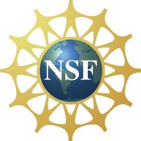

Expansionist
============

Expansionist expands tokens extracted from program identifiers found in source code files. It can produce more meaningful terms for use in machine learning and other activities.  Expansionist can be applied after splitting identifiers using a package such as [Spiral](https://github.com/casics/spiral).

*Authors*:      [Michael Hucka](http://github.com/mhucka) 
*Repository*:   [https://github.com/casics/expansionist](https://github.com/casics/expansionist) 
*License*:      Unless otherwise noted, this content is licensed under the [GPLv3](https://www.gnu.org/licenses/gpl-3.0.en.html) license.

☀ Introduction
-----------------------------

Natural language processing (NLP) methods are increasingly being applied to source code analysis for various purposes.  The methods rely on terms (identifiers and other textual strings) extracted from program source code and comments.  The methods often work better if, instead of raw identifiers, real words are used as features; that is, `get` and `string` are often better features for NLP tools than `getStr`.  This leads to the need for automated methods for splitting and expanding identifiers of classes, functions, variables, and other entities into word-like constituents.

_Expansionist_ is a program that can be applied to short tokens to produce candidate expansions based on contextual information.  The context can be, e.g., text extracted from comments, strings and file headers of source code files where the tokens are found.

⁇ Getting help and support
--------------------------

If you find an issue, please submit it in [the GitHub issue tracker](https://github.com/casics/expansionist/issues) for this repository.

♬ Contributing &mdash; info for developers
------------------------------------------

A lot remains to be done on CASICS in many areas.  We would be happy to receive your help and participation if you are interested.  Please feel free to contact the developers either via GitHub or the mailing list [casics-team@googlegroups.com](casics-team@googlegroups.com).

Everyone is asked to read and respect the [code of conduct](CONDUCT.md) when participating in this project.

❤️ Acknowledgments
------------------

This material is based upon work supported by the [National Science Foundation](https://nsf.gov) under Grant Number 1533792 (Principal Investigator: Michael Hucka).  Any opinions, findings, and conclusions or recommendations expressed in this material are those of the author(s) and do not necessarily reflect the views of the National Science Foundation.

The icon for Expansionist is "world" by Dinosoft Labs &ndash; [icon #1491944 in the Noun Project](https://thenounproject.com/search/?q=api&i=1491944).  It is used under the terms of a Creative Commons license.

 

  
  &nbsp;&nbsp;&nbsp;&nbsp;&nbsp;&nbsp;
  &nbsp;&nbsp;&nbsp;&nbsp;&nbsp;&nbsp;
  

